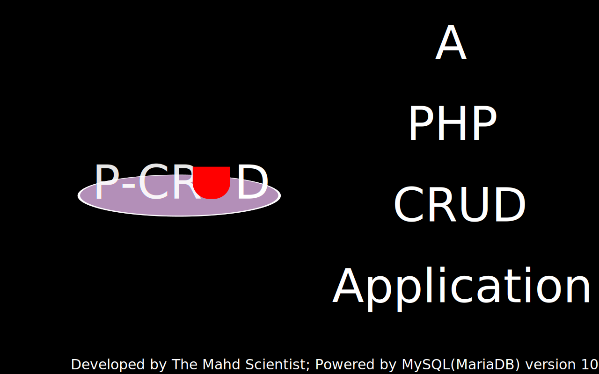

# P-CRUD

This is a functional CRUD app that runs off the web. Built using the MVC methodology, it offers the user the ability to store and retrieve terms and definitions from a persistent data store.

It also utilizes the use of a json file to persist data. Although this method is deprecated and shouldn't be used in production, contact me if you might wanna use it in the absence of a database.

###### PS: You might not find the model or controller folders anywhere; the code implementation of these are located in the `app/data` and `app` directory respectively.
The application's configuration can be found in the `app` directory

I had fun building this project. Let me know whether you found it interesting.

`I remain The Mahd Scientist`

----------

###### *Powered by MySQL(MariaDB) version 10.4.28*